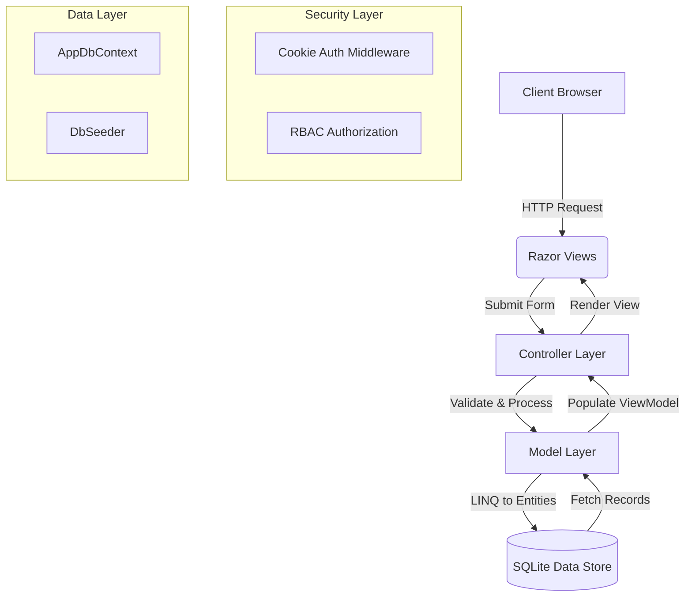

# 🏠 Dormitory Management System

> A premium, full-scale management ecosystem for student housing — engineered with a focus on modern aesthetics, robust security, and operational efficiency.


---

## 📋 Table of Contents

- [✨ About](#-about)
- [🚀 Key Features](#-key-features)
- [🎨 Modern Aesthetics](#-modern-aesthetics)
- [🛠 Tech Stack](#-tech-stack)
- [🏗 Architecture](#-architecture)
- [📊 Database Schema](#-database-schema)
- [📂 Project Structure](#-project-structure)
- [👥 User Roles](#-user-roles)
- [📦 Getting Started](#-getting-started)
- [✍️ Authors](#️-authors)

---

## ✨ About

The **Dormitory Management System** is a full-stack web application developed for the **SENG 321 – Web Development with Modern Frameworks** course. It digitizes and simplifies paper-based operations of a student housing facility — covering room allocation, membership tracking, financial records, maintenance requests, and administrative reporting.

The system is designed to provide high-fidelity operational monitoring with a premium user experience, ensuring that institutional data is handled securely and efficiently.

---

## 🚀 Key Features

| Module | Technical Highlights |
|---|---|
| 🆔 **7-Digit Identity** | Migrated from TC Identity to a custom, 7-digit **Dormitory Registration Number** system for enhanced privacy and internal tracking. |
| 🔐 **Elite Auth & Security** | Cookie-based authentication with secure password hashing and a built-in **Forgot Password** simulation flow. |
| 🛄 **Personnel Control** | Admin-only dashboard for managing staff and administrators, including a secure **cascading deletion** system. |
| 📊 **Advanced Analytics** | Real-time financial monitoring (collected vs. overdue), occupancy rate visualization, and smart management insights. |
| 🖨️ **Reporting Engine** | Export comprehensive reports to **Excel**, **PDF**, or high-fidelity **Print** formats with a single click. |
| 🔧 **Maintenance 360** | Complete ticket lifecycle: Submission → Real-time Tracking → Resolution by Staff. |
| 💰 **Financial Ledger** | Integrated dues and penalties tracking with localized currency and automated late fee configuration. |
| 📄 **Document Storage** | Upload and link specific student documents such as Identity cards and contracts. |
| 🔔 **Notifications** | Real-time in-app alerts for dues, penalties, and maintenance ticket updates. |

---

## 🎨 Modern Aesthetics

We believe that enterprise software should be both powerful and beautiful:

*   **Interactive Mascots**: Custom-designed, animated character illustrations guiding users through Login and Registration.
*   **Glassmorphism UI**: A sleek design language using frosted-glass effects, high-contrast typography (**Outfit Google Font**), and vibrant gradients.
*   **Motion Design**: Fully responsive navigation with smooth transitions powered by **AOS (Animate On Scroll)** and CSS micro-animations.
*   **Dynamic Dashboards**: Interactive charts and data visualizations powered by **Chart.js**.

---

## 🛠 Tech Stack

```bash
Backend   → C# / ASP.NET Core 8.0 MVC
Database  → SQLite + Entity Framework Core (Code-First)
Frontend  → Razor Views + HTML5 + CSS3 + Bootstrap 5
Libraries → AOS (Animations), Chart.js (Analytics), Flatpickr (Dates)
Auth      → ASP.NET Core Cookie-based Authentication
```

---

## 🏗 Architecture

The project follows a localized MVC architecture with automated database seeding and a centralized audit system.



---

## 📊 Database Schema

Our relational schema is designed for data integrity and cascading accountability:

*   **Roles ──< Users**: Core authentication layer.
*   **Users ──< Admin / Staff**: Extended profiles for personnel.
*   **Rooms ──< Students**: Occupancy-aware room allocation tracking.
*   **Students ──< DuesAndPenalties**: Comprehensive financial ledger.
*   **Students ──< Documents**: Repository for ID scans and contracts.
*   **Rooms ──< MaintenanceTickets**: Facility maintenance tracking system.
*   **AuditLogs**: Granular tracking of all administrative actions.

---

## 📂 Project Structure

```
DormitoryManagementSystem/
├── Controllers/          # Route handlers & Business Logic
│   ├── AccountController.cs    # Auth & Password Reset
│   ├── DuesController.cs       # Financial management
│   ├── ReportsController.cs    # Analytics & Exports (Excel/PDF)
│   ├── RoomsController.cs      # Facility & Occupancy
│   ├── SettingsController.cs   # System config & User Management
│   └── StudentsController.cs   # Member operations
├── Models/               # DB Entities & ViewModels
├── Views/                # Razor (.cshtml) Design System
├── Data/
│   ├── AppDbContext.cs   # Data Layer Configuration
│   └── DbSeeder.cs       # Automatic Initial Seeding
├── wwwroot/              # Static Assets (CSS, JS, Mascots)
├── Migrations/           # EF Core tracking files
├── Program.cs            # Entry point, Middleware & Localization
└── appsettings.json      # Connection strings
```

---

## 👥 User Roles

| Role | Domain Capabilities |
|---|---|
| **Admin** | Full system jurisdiction: manage all user accounts, update global dormitory settings, and access sensitive audit logs. |
| **Staff** | Daily operations: register students, manage room occupancy, issue dues/penalties, and resolve maintenance tickets. |
| **Student** | Personal portal: track personal dues, view own profile details, and submit room-specific maintenance requests. |

---

## 📦 Getting Started

### Prerequisites
*   [.NET 8.0 SDK](https://dotnet.microsoft.com/download/dotnet/8.0)
*   Visual Studio or VS Code

### Installation
1.  **Clone the Repository**:
    ```bash
    git clone https://github.com/mmustafaberkaykrgz/DormitoryManagementSystem.git
    cd DormitoryManagementSystem
    ```
2.  **Update Database**:
    ```bash
    dotnet ef database update
    ```
3.  **Run Application**:
    ```bash
    dotnet run
    ```
   *Note: On the first run, the system will automatically seed a default Admin account via `DbSeeder.cs`.*

---

## ✍️ Authors

Developed as part of **SENG 321 – Web Development with Modern Frameworks** under the supervision of **Lect. Dr. Ruhi Taş**.

| Author | Student ID |
|---|---|
| **Mustafa Berkay Karagöz** | 220208010 |
| **Şeyma Bayram** | 220208045 |
| **Kerim Taşkın** | 220208927 |

---

*SENG 321 · Web Development with Modern Frameworks · 2025–2026*